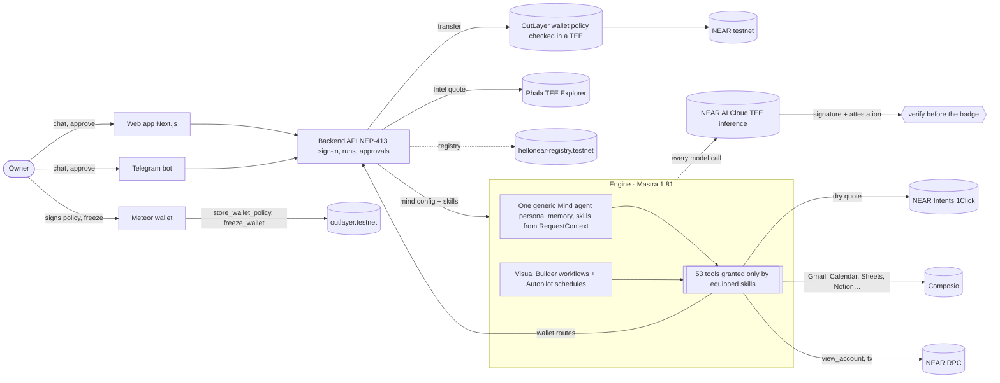
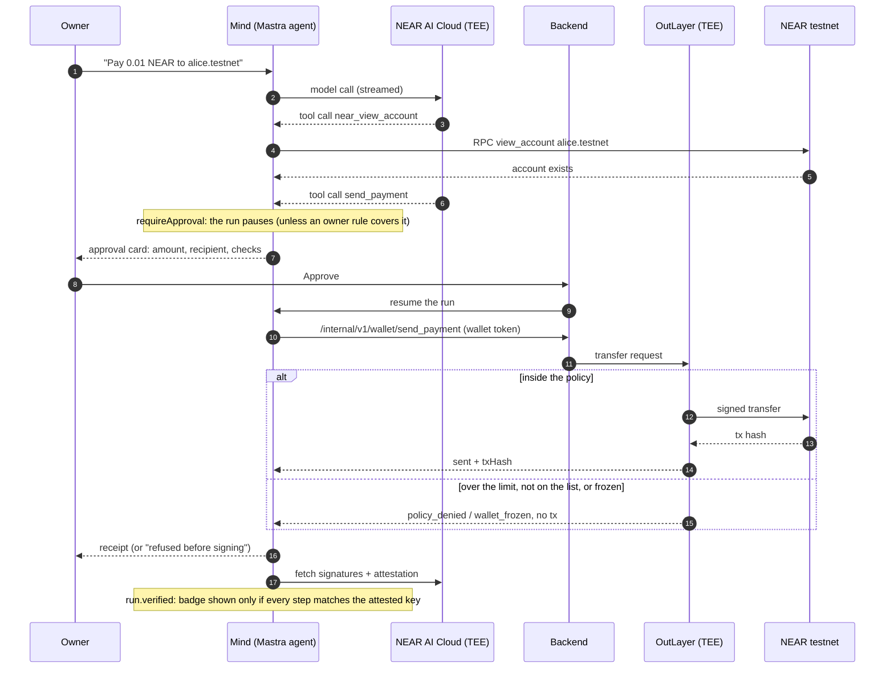

```mermaid
flowchart LR
    O([Owner]) -->|chat, approve| FE[Web app Next.js]
    O -->|chat, approve| TG[Telegram bot]
    O -->|signs policy, freeze| MW[Meteor wallet]
    FE --> BE[Backend API NEP-413 sign-in, runs, approvals]
    TG --> BE
    BE -->|mind config + skills| EN

    subgraph EN[Engine · Mastra 1.81]
        direction TB
        AG[One generic Mind agent persona, memory, skills from RequestContext]
        TL[[53 tools granted only by equipped skills]]
        WF[Visual Builder workflows + Autopilot schedules]
        AG --> TL
        WF --> TL
    end

    EN -->|every model call| NAI[(NEAR AI Cloud TEE inference)]
    NAI -->|signature + attestation| VER{{verify before the badge}}
    TL -->|wallet routes| BE
    BE -->|transfer| OL[(OutLayer wallet policy checked in a TEE)]
    MW -->|store_wallet_policy, freeze_wallet| OLC[(outlayer.testnet)]
    OL --> NEAR[(NEAR testnet)]
    TL -->|dry quote| INT[(NEAR Intents 1Click)]
    TL -->|Gmail, Calendar, Sheets, Notion…| CMP[(Composio)]
    BE -->|Intel quote| TEX[(Phala TEE Explorer)]
    TL -->|view_account, tx| RPC[(NEAR RPC)]
    BE -.->|registry| REG[(hellonear-registry.testnet)]
```

### One payment, call by call

```mermaid
sequenceDiagram
    autonumber
    participant O as Owner
    participant A as Mind (Mastra agent)
    participant M as NEAR AI Cloud (TEE)
    participant B as Backend
    participant W as OutLayer (TEE)
    participant N as NEAR testnet

    O->>A: "Pay 0.01 NEAR to alice.testnet"
    A->>M: model call (streamed)
    M-->>A: tool call near_view_account
    A->>N: RPC view_account alice.testnet
    N-->>A: account exists
    M-->>A: tool call send_payment
    Note over A: requireApproval: the run pauses (unless an owner rule covers it)
    A-->>O: approval card: amount, recipient, checks
    O->>B: Approve
    B->>A: resume the run
    A->>B: /internal/v1/wallet/send_payment (wallet token)
    B->>W: transfer request
    alt inside the policy
        W->>N: signed transfer
        N-->>W: tx hash
        W-->>A: sent + txHash
    else over the limit, not on the list, or frozen
        W-->>A: policy_denied / wallet_frozen, no tx
    end
    A-->>O: receipt (or "refused before signing")
    A->>M: fetch signatures + attestation
    Note over A: run.verified: badge shown only if every step matches the attested key
```

---
